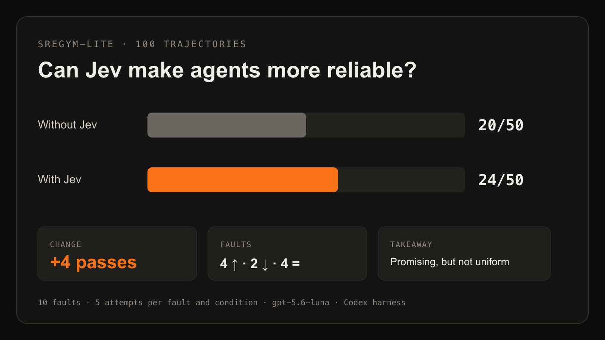
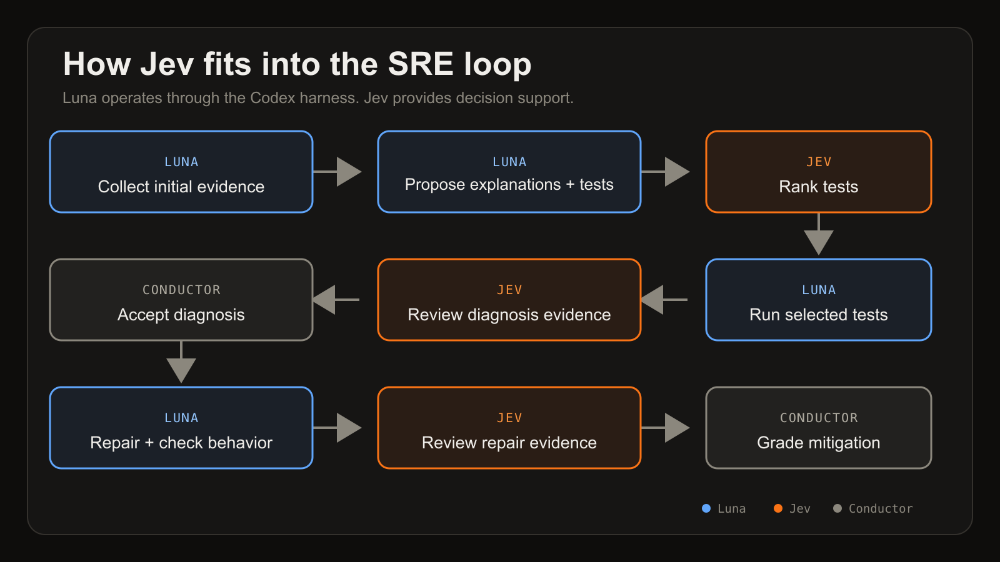

# Jev blog announcement thread

Draft copy for the SREGym account. Text beneath each heading is the post; images are upload notes and are not part of the character count.

## Post 1/8

Jev from @typesafeai has drawn attention for its speed and performance on structured decisions. We explored what that capability could do for SRE.

We built tools that make Jev available to the agent, then benchmarked Codex with gpt-5.6-luna on 10 SREGym-Lite problems. 🧵

## Post 2/8

Jev is TypeSafe AI's first System One Model, built for fast, focused judgments.

Our tools:
• jev_plan ranks proposed tests
• jev_submit reviews evidence before diagnosis or mitigation

Each question needed ≥0.70. The agent still ran the tests and acted.

## Post 3/8

We ran five attempts per problem in each condition.

Without Jev: 20/50 passes (40%)
With Jev: 24/50 passes (48%)

Four problems improved, two regressed, and four were unchanged. Encouraging, but not enough to claim a general eight-point improvement.

## Post 4/8

Where Jev helped most: the internal-traffic-policy problem improved from 0/5 → 3/5.

Baseline agents chased telemetry noise. Jev rejected a weak causal explanation, prompting tests that connected frontend timeouts to the Service policy and cross-node endpoint placement.

## Post 5/8

Where Jev failed: recovery was mistaken for a durable repair.

Agents restored current functionality while leaving a namespace quota, unsafe rollout settings, or a reverted credential rotation. Jev did not fully test the invariants needed for the repair to remain correct.

## Post 6/8

Jev also could not rescue a missing hypothesis.

Some runs never tested the faulty Service selector or PVC placement conflict. If the correct explanation and test never enter the candidate set, ranking the available options cannot recover them.

## Post 7/8

Next, we want to move Jev earlier into the action loop: aggregate 3–5 votes, ask which action is most informative after each tool call, and compare results across model capability levels.

We also want to test mitigation-safety review. We have not run that experiment.

## Post 8/8

Radical idea: safely collect broad views of cluster state, classify incident and root-cause labels in parallel, then use ranked outputs to guide the investigation.

Jev is a decision aid, not an oracle. We are excited to test it across SRE.

What more experiments would you like to see?

Read: [BLOG LINK]
